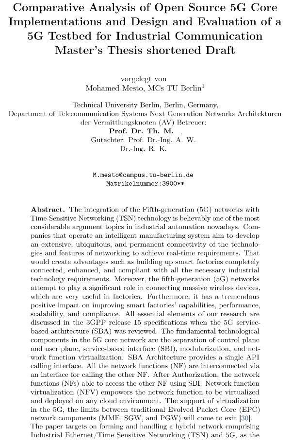
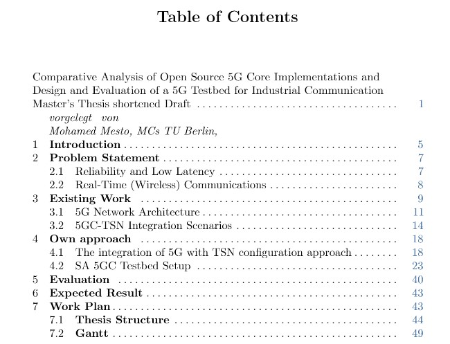
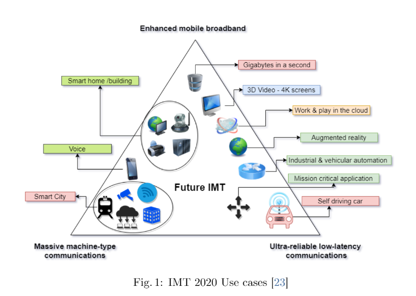
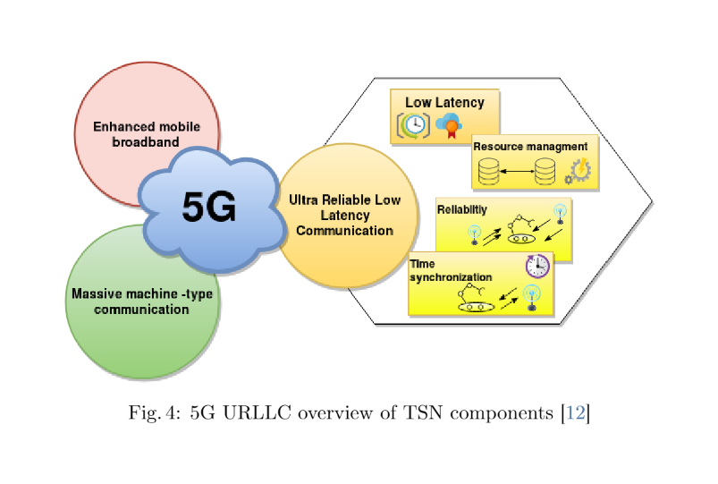
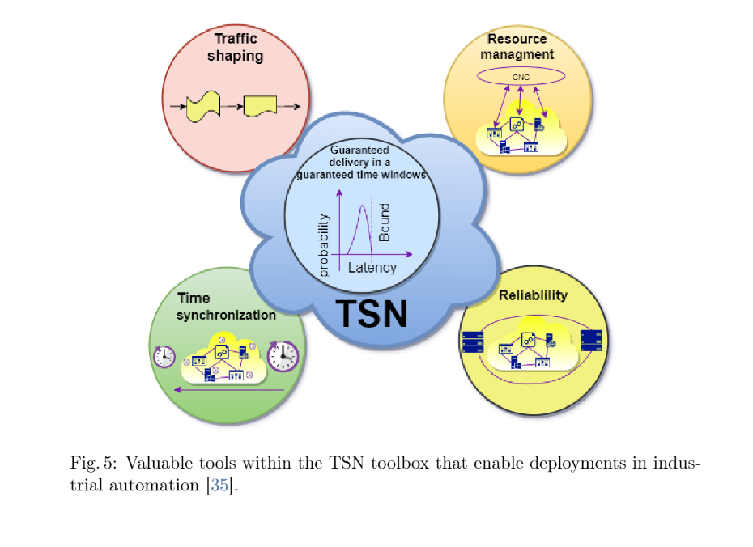
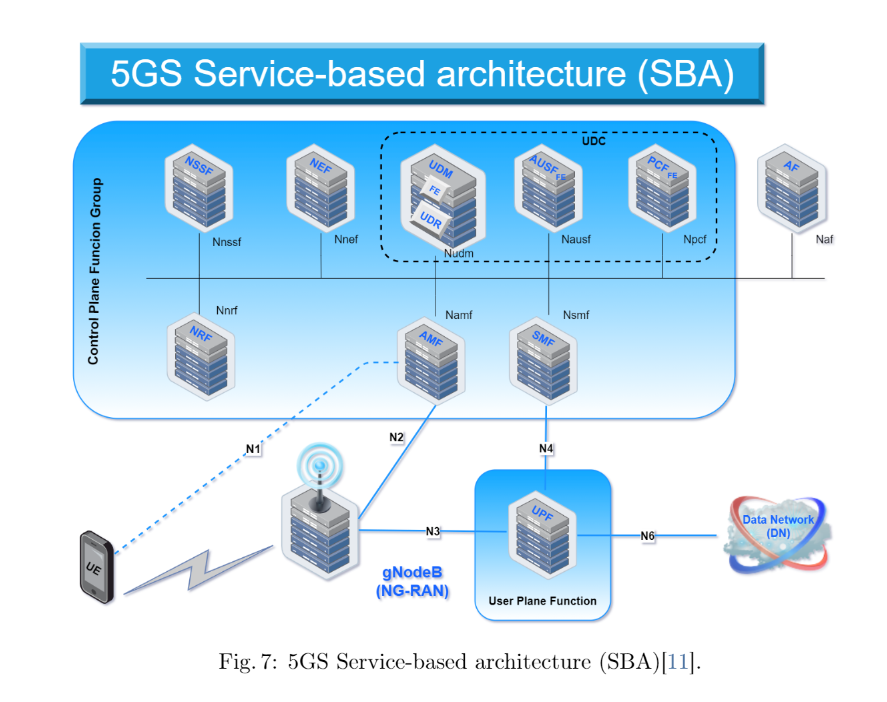
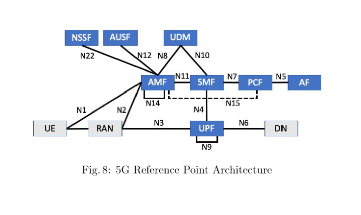
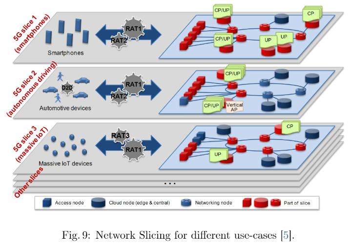

<table border=0>
<tr border=0>
<td>  </td>
  <td align="center"> <h5><a href="https://www.fokus.fraunhofer.de/en">by Fraunhofer Institute for Open Communication Systems (Fokus) Institute.</a></h5> </td>
  <td>  </td>
</tr>
<tr border=0>
<td> </td><td  align="center"><h5> Thesis Topic </h5> </td><td> </td>
</tr>
<tr border=0>
<td> </td><td> </td><td> </td>
</tr>
  <tr>
    <td> </td>
<td align="center"><h5><a href="https://github.com/fraunhoferfokus">" Comparative Analysis of Open Source 5G Core Implementations and Design and Evaluation of a 5G Testbed for Industrial Communication Master’s Thesis shortened Draft"</a></h5></td>
    <td> </td>
</tr>
  <tr>
    <td> </td>  <td align="center">Supervisor Prof.Dr. Ing Th. M. </td>
    <td> </td>
</tr>
</table>

 ## Abstract.
 The integration of the Fifth-generation (5G) networks with Time-Sensitive Networking (TSN) technology is believably one of the most considerable argument topics in industrial automation nowadays. Companies that operate an intelligent manufacturing system aim to develop an extensive, ubiquitous, and permanent connectivity of the technologies and features of networking to achieve real-time requirements. That would create advantages such as building up smart factories completely connected, enhanced, and compliant with all the necessary industrial technology requirements. Moreover, the fifth-generation (5G) networks attempt to play a significant role in connecting massive wireless devices, which are very useful in factories. Furthermore, it has a tremendous positive impact on improving smart factories' capabilities, performance, scalability, and compliance. All essential elements of our research are discussed in the 3GPP release 15 specifications when the 5G service-based architecture (SBA) was reviewed. The fundamental technological components in the 5G core network are the separation of control plane and user plane, service-based interface (SBI), modularization, and network function virtualization. SBA Architecture provides a single API calling interface. All the network functions (NF) are interconnected via an interface for calling the other NF. After Authorization, the network functions (NFs) able to access the other NF using SBI. Network function virtualization (NFV) empowers the network function to be virtualized and deployed in any cloud environment. With the support of virtualization in the 5G, the limits between traditional Evolved Packet Core (EPC) network components (MME, SGW, and PGW) will come to exit. 

## Contributors
- Mohamed Mesto m.mesto@campus.tu-berlin.de  , Mohamedmesto111@gmail.com

## License & copyright
© Mohamed Mesto
License under the [MIT License] (LICENSE).

